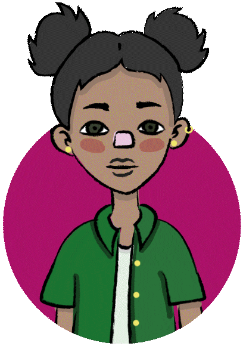

# 🌿 Parlons Drogues !!! Les Dangers du Cannabis

> **Sujet du projet** : Santé humaine  
> **Thème exploré** : Les effets du **cannabis**

## Sommaire

- [Présentation du Projet](#présentation-du-projet)  
- [Équipe projet](#équipe-projet)  
- [Technologies Utilisées](#technologies-utilisées)  
- [Installation et Lancement](#installation-et-lancement)
- [Photos du Site](#photos-du-site)

---

## Présentation du Projet

**Parlons-Drogues** est un projet de **datavisualisation** axé sur la santé et le bien-être humain, dans lequel nous avons exploré les effets du cannabis.

Nous avons eu deux mois pour réaliser ce projet et avons récolté de vraies sources fiables afin de garantir la précision de nos données (souces sur le site). L’objectif était de représenter des jeux de données, pour offrir une meilleure compréhension du sujet.

Le projet est divisé en **trois chapitres**, chacun racontant l’histoire percutante d’un personnage affecté par le cannabis. Ces chapitres illustrent les effets négatifs que le cannabis a eus sur leur vie, tout en utilisant des données et des informations pertinentes pour enrichir le récit. Chaque chapitre comprend des éléments interactifs, permettant aux utilisateurs de s'engager avec l’histoire et d’en apprendre davantage sur le parcours du personnage ainsi que sur l'impact plus large du cannabis à travers des visualisations de données.

Toutes nos sources comme on la dit sont authentiques, et notre cible principale sont les adolescents de 15 à 18 ans, car c'est à cet âge que l’on s'intéresse particulièrement à ce genre de sujet. Nous visons à sensibiliser notre public et à offrir une compréhension approfondie du sujet.

<table align="center">
  <tr>
    <td align="center">
      <strong>Chapitre 1 : Alena</strong><br/>
      
    </td>
    <td align="center">
      <strong>Chapitre 2 : Raph</strong><br/>
      
    </td>
    <td align="center">
      <strong>Chapitre 3 : Ines</strong><br/>
      
    </td>
  </tr>
</table>

---

## Équipe projet

- **1 Développeur** : Intégration, interactivité, datavisualisation 
- **3 Designers** : Création des visuels, mise en page, illustrations, prototype UI/UX sur Figma

---

## Technologies Utilisées

|     Développeur                             |    Designer                                   |
|---------------------------------------------|-----------------------------------------------|
|  |  |
|    |  |
|  |  |
|    |                                               |

---

## Installation et Lancement

Vous pouvez soit consulter directement le projet en ligne, soit le lancer localement :

### Option 1 : Consulter en ligne

Accédez au projet via ce lien :  
[https://parlons-drogues.vercel.app](https://parlons-drogues.vercel.app)

### Option 2 : Lancer localement

## Prérequis

- Vue.js (version 3)
- Node.js (version 14 ou supérieure)  
- npm (inclus avec Node.js)

## Étapes pour démarrer
  
1. Clonez le projet :  
   ```bash
   git clone <URL_DU_REPOSITORY>
   cd <NOM_DU_REPOSITORY>
2. Installez les dépendances :
    ```bash
    npm install
3. Lancez le serveur de développement :
    ```bash
    npm run dev

---

## Photos du Site
<p align="center">
  
  
</p>
<p align="center">
  
  
</p>
<p align="center">
  
</p>
